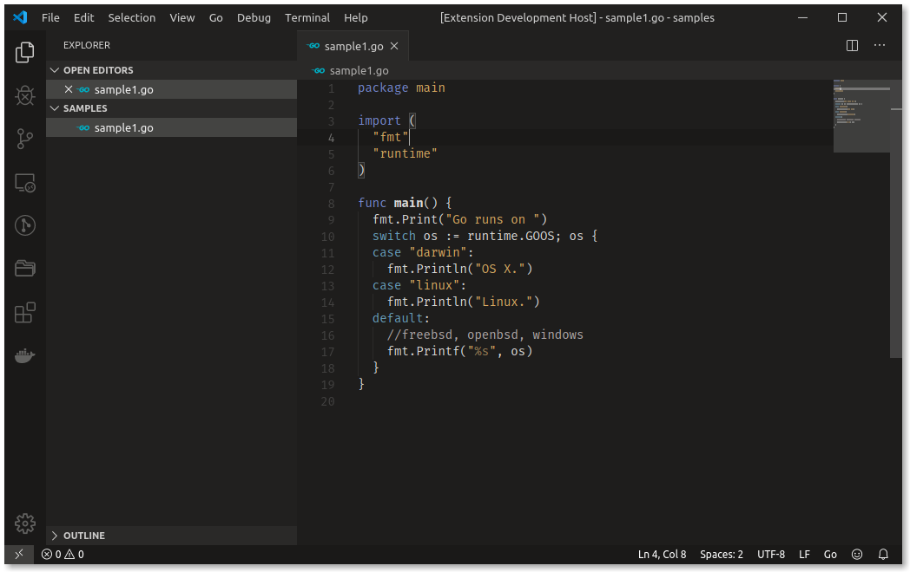
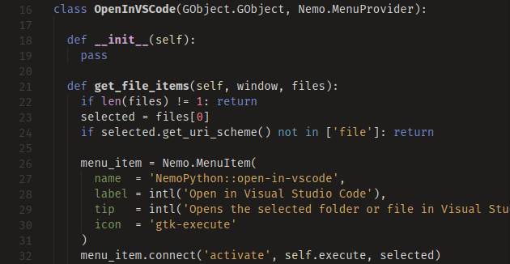
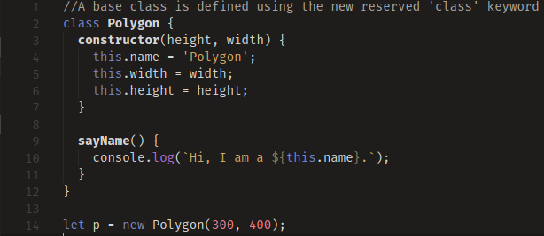
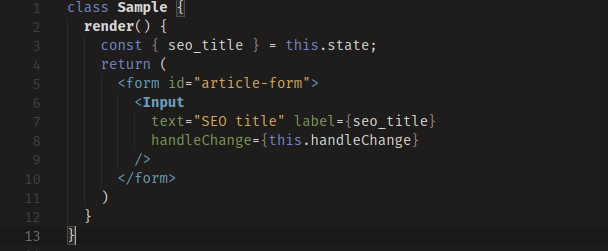
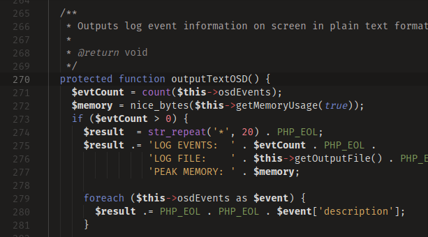

# Dark Taste Theme

A dark theme focusing on low contrast ratio and warm, dark gray backgrounds.
Better suitable for dark environments.

I hope you like it. Feedback is welcome!

Light version: [**Good Taste Theme**](https://marketplace.visualstudio.com/items?itemName=faelv.good-taste-theme)

Font used: [**Fira Mono**](https://mozilla.github.io/Fira/)

## Supported languages:

- **C#**
- **CSS**
- **Go**
- **HTML**
- **JavaScript ( +React )**
- **JSON**
- **PHP**
- **Python**
- **Pug**
- **Sass / SCSS**
- **SQL**
- **TypeScript ( +React )**

Other languages may work too, even without specific support.

## Support

### Brackets have wrong / funny colors

It's a VSCode feature. If you don't like it, disable it by uncheking **Editor > Bracket Pair Colorization** in Settings or manually by adding `"editor.bracketPairColorization.enabled": false`

### Something else?

Open an issue [here](https://github.com/faelv/dark-taste-theme/issues).

## Screenshots:

### Python

### JS

### JSX / React

### PHP

